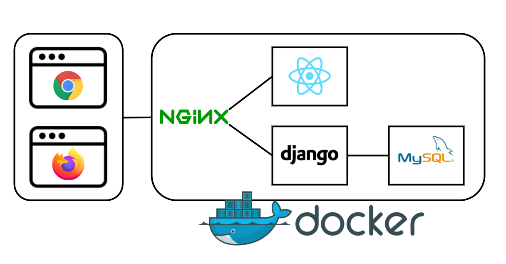

# 🎮 GATCHA - STEAM 게임 추천 서비스

> **사용자 리뷰** 기반 STEAM 게임 추천 서비스

 

## 👨‍👨‍👧‍👦 팀원

**🧡정성학**

- **2nd 팀장**

**💛공형규**

- **프론트엔드**

**💚김민지**

- **백엔드**

**💙손현식**

- **백엔드**

 

## 📋 프로젝트 개요

### 진행 기간

- 2021.08.30 ~ 2021.10.08

 

### 기획 배경

**GATCHA**는 사용자 리뷰 기반으로 STEAM 게임을 추천해주는 서비스입니다.

STEAM은 세계 최대 규모의 전자 게임 소프트웨어 유통망입니다. 월간 활성 사용자 9000만명, 매월 신규 구매자가 160만명에 다를 만큼 많은 사람들이 이미 STEAM 서비스를 이용 중이며, 새로운 신규 유저의 유입도 많습니다.

하지만, 한번도 STEAM 게임을 접해보지 못한 사용자가 자기 취향의 게임을 찾는 것이 쉽지 않으며, 기존 유저들도 자신의 취향에 맞는 새로운 게임을 원하는 사람이 많습니다.

>  어지러운 스팀의 메인 페이지...

**GATCHA**는 STEAM 게임을 사용해 본 경험과 상관 없이 누구에게나 자신의 취향에 맞는 게임을 추천해주는 서비스입니다.
**2275**개의 게임 데이터, **703986**개의 리뷰 데이터를 토대로 분석을 실시하며, 사용자의 게임 평가 데이터가 쌓일수록 더욱 정확한 게임 추천 기능을 제공합니다.

**GATCHA**를 통해서 STEAM 게임 한 입.. 어떻습니까??

 

### 목표

- 콘텐츠 기반 필터링, 협업 기반 필터링으로 사용자 맞춤 게임 추천 서비스를 제공합니다.
- 게임 장르에 대한 질문 구성으로 STEAM 게임 경험이 없는 사람들에게도 추천 서비스를 제공합니다.
- 게임 UI를 바탕으로 즐거운 사용자 경험을 제공합니다.
- 사용자들이 남긴 리뷰들로 Word Cloud를 만들어 게임의 특징을 한눈에 파악할 수 있습니다.

 

### 와이어프레임

 

## 💻 기능 및 화면 구성

[시나리오](/assets/시나리오.pdf)

 

## 💾 ERD

 

## 📚 기술 스택

**Back**

- Django
- MySQL
- NGINX
- Docker
- WordCloud

**Front**

- React
- Redux
- Phaser 3

 

## 🔧 시스템 아키텍처

 

## ⚙ 개발 환경 및 라이브러리

- python: 3.9.7
- Django: 3.2.7
- React: 17.0.2
- node: 14.17.1
- MySQL: 8.0.22
- nginx: 1.21.3
- [requirements.txt](assets/requirements.txt)

 

## 📃 UCC
[UCC](assets/GatchaUCC.mp4)

## 📃 최종 산출물
[최종발표 PPT](assets/GATCHA_발표자료.pdf)
