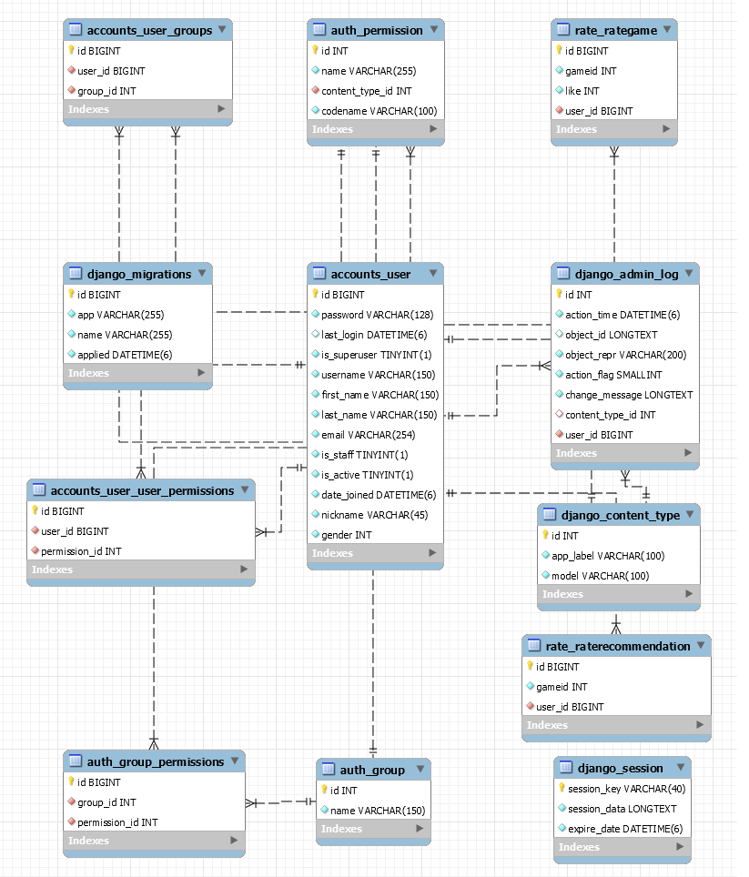

# 산출물

#### 1. gitlab 소스 클론 이후 빌드 및 배포할 수 있는 작업 문서

1. **사용한 JVM, 웹서버, WAS 제품 등의 종류와 설정값, 버전(IDE 버전 포함) 기재**

   - pycharm: 2021.1
   - python : 3.9.7
   - VsCode: 1.60.2
   - nginx: 1.21.3
   - Django: 3.2.7
   - node: 14.17.1

2. **빌드 시 사용되는 환경 변수 등의 주요 내용 상세 기재**

   - 데이터베이스 도커 실행
     - docker run -d -p 3306:3306 -e MYSQL_ROOT_PASSWORD=j5a402.p.ssafy --name mysql-gatcha -v /home/ec2-user/db:/var/lib/mysql mysql:8.0.22 --character-set-server=utf8mb4 --collation-server=utf8mb4_unicode_ci
   - bigdata_pjt에서 'docker-compose up -d'로 실행

3. **배포 시 특이사항 기재**

   - 리액트 코드 수정시 반영 안되는 문제 있어서 도커를 삭제했다가 다시 설치해야함

4. **데이터베이스 접속 정보 등 프로젝트(ERD)에 활용되는 주요 계정 및 프로피터가 정의된 파일 목록**

   

 

#### 2. 프로젝트에서 사용하는 외부 서비스 정보 문서

- 구글 YourTube API
  - https://console.cloud.google.com/apis/dashboard

 

#### 3. 데이터베이스 덤프 파일 최신본

없음

 

#### 4. 시연 시나리오

[시나리오](/assets/시나리오.pdf)
